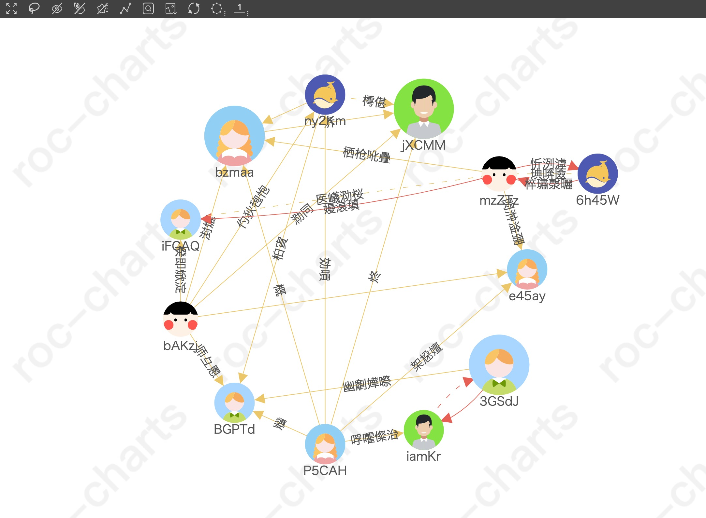

## 关于此框架
此框架基于 zrender 开发，用于展现节点之间的关系。关系的呈现（图谱布局）主要还是由使用者决定，可以很简单的将自己的布局算法加入到此框架中，而框架更多的作用是实现图谱操作功能，此框架内置了一些常用功能，也提供了插件机可供开发更多功能。
  
  

[**点击查看在线 Demo**](https://hepeng10.github.io/roc-charts-demo/#/)

[**点击查看完整文档**](https://hepeng10.github.io/roc-charts-document/)

## 框架的使用
src/containers/Test/test.jsx 文件有基本的用法。

可下载项目，安装依赖后（推荐使用 yarn 安装），运行 yarn start 查看效果。

### 安装 roc-charts:
yarn add roc-charts  或 npm install roc-charts
```js
import Chart from 'roc-charts;
```
或者下载项目，拷贝出 src/chart 目录到自己的项目中使用相对路径引入
```js
import Chart from './chart';  // 本地引入
```
**Chart 的使用**
```js
const chart = new Chart({
    id: 'chart',  // 绘制图谱 dom 的 id
    type: 'force',  // 图谱类型
    data: chartData,  // 图谱数据
});
chart.init(config);  // 调用 init 方法绘图，配置项可选
```

### 基本参数说明
图谱接收的 data 数据为一个对象，包括 nodes（节点） 和 links（节点之间的连线） 两个数组
```javascript
const chartData = {
    nodes: [
        {
            id: 1,  // 节点 id
            name: 'xxx',  // 节点名称（可选）
        },
        ...
    ],
    links: [
        {
            from: 1,  // 开始节点 id
            to: 2,  // 结束节点 id
            text: 'yyy',  // 线上的文字（可选）
        }
        ...
    ]
}
```
将包含 nodes 和 links 的对象传入 data 中就能绘图了。

## 图谱扩展
**自定义图谱：**
```javascript
import Chart, { ChartBase } from 'roc-charts';

// 创建自己的图谱布局类。继承 ChartBase，通过 compute 方法计算坐标
class CustomChart extends ChartBase {
    // 必须的静态属性，图谱中会用到
    static chartName = 'customChart';  // 设置图谱的名称，初始化图谱及切换图谱使用
    static chartZhName = '自定义图谱';  // 设置中文名称，切换图谱插件中鼠标悬停显示
    static icon = icon;  // 设置 dataURI 图标，切换图谱插件使用
    
    // compute 方法中获取 store，通过算法修改 store 中 nodes 的 position 实现自定义图谱布局
    compute() {
        const { nodes } = this.$store;
        // 修改节点的 position 即可
        nodes.forEach((node, i) => {
            const x = positions[i].x;
            const y = positions[i].y;
            node.position = [x, y];
        });
    }
}
// 通过 registerChart 方法注册自定义图谱布局即可使用
Chart.registerChart(CustomChart);

const chart = new Chart({
    id: 'xx',
    type: 'customChart',  // 上面设置的图谱名称
    data
});
```


**自定义插件：**
```javascript
import Chart, { PluginBase } from 'roc-charts';

class CustomPlugin extends PluginBase {
    // 设置插件的名称
    static pluginName = 'customPlugin';
    
    // 实现插件功能
    init() {
        ...
    }
}
// 注册自定义插件
Chart.registerPlugin(CustomPlugin);
```

[**点击查看完整文档**](https://hepeng10.github.io/roc-charts-document/)
